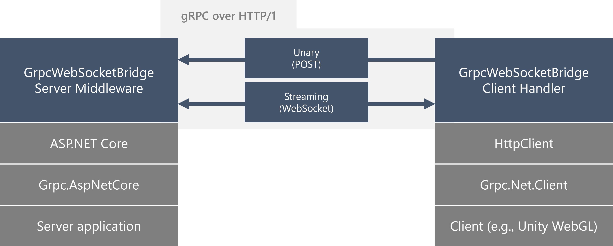

# GrpcWebSocketBridge
Yet Another gRPC over HTTP/1 using WebSocket implementation, primarily targets .NET platform.



## Supported features
- Unary
- DuplexStreaming
- ClientStreaming
- ServerStreaming (Only supported in Always WebSocket mode)

### Limitations
- Deadline not supported
- Request Trailer not supported

## Implementation details
- Unary: Porting grpc-web (Binary Mode) of Grpc.Net.Client.Web/Grpc.AspNetCore.Server.Web communicating over HTTP/1.
- Streaming: Custom protocols based on grpc-web's wire-protocol for communication via WebSocket.


## Requirements
### Server
- gRPC server built on ASP.NET Core
    - .NET 8 or later
    - Web server listening on HTTP/1
    - When using with MagicOnion, use MagicOnion 7.0.0 or later
### Client
- .NET 8 or later (Console, Blazor WebAssembly)
- Unity 2022.3 or later
  - We strongly recommend a newer version when trying WebGL builds, as older versions have behavioural issues.

## How to run a sample project

The repository contains sample projects. You can run a simple sample app (Unity WebGL) as follows.

- Move the current directory to `samples\GrpcSampleApp.Server\`
- Execute `dotnet run`
- Open https://localhost:7172/index.html in a browser.

## Getting started
### Server
#### Install `GrpcWebSocketBridge.AspNetCore` package
NuGet package needs to be installed on the server. Add `GrpcWebSocketBridge.AspNetCore` package to your project.

```plaintext
dotnet add package GrpcWebSocketBridge.AspNetCore
```

#### Enable GrpcWebSocketBridge on the server (.NET 8+)
Enable middleware as a bridge and register a service to use WebSockets.

If the application and API server are different Origins, you need to register the CORS services to use CORS.

```csharp
builder.Services.AddGrpc();
builder.Services.AddCors(options =>
{
    options.AddDefaultPolicy(policy =>
    {
        // WARN: Do not apply following policies to your production.
        //       If not configured carefully, it may cause security problems.
        policy.AllowAnyMethod();
        policy.AllowAnyOrigin();
        policy.AllowAnyHeader();

        // NOTE: "grpc-status" and "grpc-message" headers are required by gRPC. so, we need expose these headers to the client.
        policy.WithExposedHeaders("grpc-status", "grpc-message");
    });
});
```

> [!WARNING]
> In this example, all are set to accept, but CORS policies should be configured with care to avoid security issues.

Add `CORS`, `WebSockets`, `GrpcWebSocketRequestRoutingEnabler` and `GrpcWebSocketBridge` middleware.

```csharp
var app = builder.Build();

// Configure the HTTP request pipeline.

// Enable CORS, WebSocket, GrpcWebSocketRequestRoutingEnabler
// NOTE: These need to be called before `UseRouting`.  
app.UseCors();
app.UseWebSockets();
app.UseGrpcWebSocketRequestRoutingEnabler();

app.UseRouting();

// NOTE: `UseGrpcWebSocketBridge` must be called after calling `UseRouting`.
app.UseGrpcWebSocketBridge();

app.MapGrpcService<GreeterService>();
app.MapGet("/", () => "Communication with gRPC endpoints must be made through a gRPC client. To learn how to create a client, visit: https://go.microsoft.com/fwlink/?linkid=2086909");

app.Run();
```

### Client (.NET 8 or later; Blazor WebAssembly)
Add `Grpc.Net.Client` and `GrpcWebSocketBridge.Client` package to your project.

#### Use GrpcWebSocketBridge handler with GrpcChannel
You need to change your code to use WebSocket instead of HTTP/2 for gRPC channels.

```csharp
var channel = GrpcChannel.ForAddress("https://localhost:5000");
```

Change the code to use GrpcWebSocketBridgeHandler as follows:

```csharp
var channel = GrpcChannel.ForAddress("https://localhost:5000", new GrpcChannelOptions()
{
    HttpHandler = new GrpcWebSocketBridgeHandler()
});
```

### Client (Unity)
To install GrpcWebSocketBridge, you need to follow three steps:

1. Install [NuGetForUnity](https://github.com/GlitchEnzo/NuGetForUnity)
2. Install Grpc.Net.Client and System.IO.Pipelines from NuGet
3. Install GrpcWebSocketBridge from Unity Package Manager

Install GrpcWebSocketBridge using Unity Package Manager with the following URL:
```
https://github.com/Cysharp/GrpcWebSocketBridge.git?path=/src/GrpcWebSocketBridge.Client.Unity/Assets/Plugins/GrpcWebSocketBridge#{Version}
```

> [!NOTE]
> {Version} is the version number you want to install (e.g. `1.0.0``).

> [!NOTE]
> If you want to build your application for WebGL, you need to add `WebGLThreadDispatcher` (see below section) or install custom versions of Grpc.Net.Client and Grpc.Net.Common by Cysharp. Those assemblies are available from GitHub Release page.

#### Use GrpcWebSocketBridge handler with GrpcChannel
You need to change your code to use WebSocket with GrpcWebSocketBridgeHandler instead of HTTP/2 for gRPC channels.

```csharp
var channel = GrpcChannel.ForAddress("https://localhost:5000");
```

Change the code to use GrpcWebSocketBridgeHandler as follows:

```csharp
var channel = GrpcChannel.ForAddress("https://localhost:5000", new GrpcChannelOptions()
{
    HttpHandler = new GrpcWebSocketBridgeHandler()
});
```

If you want to keep channels in your application code, it is recommended to use the `Grpc.Core.ChannelBase` class instead of the `Grpc.Core.Channel` class. It is the base class for all channels.

#### Add `WebGLThreadPoolDispatcher` (WebGL)

On WebGL, Unity Player cannot use ThreadPool, so if there is code in the library that waits for `Task` with `ConfigureAwait(false)`, the continuation (processing after await) may not be executed.
To avoid this issue, you need to use `WebGLThreadPoolDispatcher`.

`WebGLThreadPoolDispatcher` is a workaround that executes ThreadPool processing in the Unity main thread loop (`Update`).
This is a hacky workaround using reflection, but it is sufficient to avoid cases where the continuation is scheduled on the ThreadPool and stuck due to `ConfigureAwait(false)` in libraries such as grpc-dotnet.

```csharp
#if UNITY_WEBGL
using System.Reflection;
using System;
using UnityEngine.LowLevel;
using UnityEngine;

namespace Cysharp.Threading
{
    /// <summary>
    /// Workaround for the issue that Unity Player on WebGL does not support ThreadPool.
    /// It calls ThreadPool's PerformWaitCallback internal method in the Unity's main thread loop forcibly.
    /// </summary>
    /// <remarks>
    /// Especially when using a library that uses Task's ConfigureAwait(false), the continuation may be scheduled on the ThreadPool and stuck.
    /// This workaround forcibly executes the ThreadPool to avoid the stuck.
    /// </remarks>
    public static class WebGLThreadPoolDispatcher
    {
        private static Func<bool> _performWaitCallback;

        public struct Dispatch { }

#if !UNITY_EDITOR
        // Enable the method to be called when running in a WebGL environment
        [RuntimeInitializeOnLoadMethod]
#endif
        public static void Initialize()
        {
            var type_ThreadPoolWaitCallback = Type.GetType("System.Threading._ThreadPoolWaitCallback");
            var methodPerformWaitCallback = type_ThreadPoolWaitCallback.GetMethod("PerformWaitCallback", BindingFlags.NonPublic | BindingFlags.Static);
            _performWaitCallback = (Func<bool>)methodPerformWaitCallback.CreateDelegate(typeof(Func<bool>));

            var playerLoopSystemForDispatch = new PlayerLoopSystem()
            {
                type = typeof(Dispatch),
                updateDelegate = PerformWaitCallback,
            };
            var playerLoop = PlayerLoop.GetCurrentPlayerLoop();
            for (var i = 0; i < playerLoop.subSystemList.Length; i++)
            {
                if (playerLoop.subSystemList[i].type == typeof(UnityEngine.PlayerLoop.Update))
                {
                    var subSystemList = new PlayerLoopSystem[playerLoop.subSystemList[i].subSystemList.Length + 1];
                    Array.Copy(playerLoop.subSystemList[i].subSystemList, subSystemList, playerLoop.subSystemList[i].subSystemList.Length);
                    subSystemList[subSystemList.Length - 1] = playerLoopSystemForDispatch;
                    playerLoop.subSystemList[i].subSystemList = subSystemList;
                    break;
                }
            }

            PlayerLoop.SetPlayerLoop(playerLoop);
        }

        private static void PerformWaitCallback()
        {
            _performWaitCallback();
        }
    }
}

#endif
```

It is still strongly recommended to use UniTask instead of Task in user code, even if you use this code.

## Troubleshooting

### Cannot connect to the server.
- Listening on HTTP/1 is required.
    - WebSocket connects via HTTP/1; connecting to a port where the `Protocols` setting of Kestreal is `Http2` only will result in an error.
- Connecting to an API server on a different domain to the server you are serving a HTML.
    - When connecting to an API server with a different domain CORS in ASP.NET Core needs to be configured.

## License

```
MIT License

Copyright (c) Cysharp, Inc.

Permission is hereby granted, free of charge, to any person obtaining a copy
of this software and associated documentation files (the "Software"), to deal
in the Software without restriction, including without limitation the rights
to use, copy, modify, merge, publish, distribute, sublicense, and/or sell
copies of the Software, and to permit persons to whom the Software is
furnished to do so, subject to the following conditions:

The above copyright notice and this permission notice shall be included in all
copies or substantial portions of the Software.

THE SOFTWARE IS PROVIDED "AS IS", WITHOUT WARRANTY OF ANY KIND, EXPRESS OR
IMPLIED, INCLUDING BUT NOT LIMITED TO THE WARRANTIES OF MERCHANTABILITY,
FITNESS FOR A PARTICULAR PURPOSE AND NONINFRINGEMENT. IN NO EVENT SHALL THE
AUTHORS OR COPYRIGHT HOLDERS BE LIABLE FOR ANY CLAIM, DAMAGES OR OTHER
LIABILITY, WHETHER IN AN ACTION OF CONTRACT, TORT OR OTHERWISE, ARISING FROM,
OUT OF OR IN CONNECTION WITH THE SOFTWARE OR THE USE OR OTHER DEALINGS IN THE
SOFTWARE.

GrpcWebSocketBridge includes and derives from some third party source codes. They are under the original license.

================================================================================
src/GrpcWebSocketBridge.Client/External/System.Memory/
src/GrpcWebSocketBridge.Shared/External/System.Memory/
================================================================================
The MIT License (MIT)

Copyright (c) .NET Foundation and Contributors

All rights reserved.

Permission is hereby granted, free of charge, to any person obtaining a copy
of this software and associated documentation files (the "Software"), to deal
in the Software without restriction, including without limitation the rights
to use, copy, modify, merge, publish, distribute, sublicense, and/or sell
copies of the Software, and to permit persons to whom the Software is
furnished to do so, subject to the following conditions:

The above copyright notice and this permission notice shall be included in all
copies or substantial portions of the Software.

THE SOFTWARE IS PROVIDED "AS IS", WITHOUT WARRANTY OF ANY KIND, EXPRESS OR
IMPLIED, INCLUDING BUT NOT LIMITED TO THE WARRANTIES OF MERCHANTABILITY,
FITNESS FOR A PARTICULAR PURPOSE AND NONINFRINGEMENT. IN NO EVENT SHALL THE
AUTHORS OR COPYRIGHT HOLDERS BE LIABLE FOR ANY CLAIM, DAMAGES OR OTHER
LIABILITY, WHETHER IN AN ACTION OF CONTRACT, TORT OR OTHERWISE, ARISING FROM,
OUT OF OR IN CONNECTION WITH THE SOFTWARE OR THE USE OR OTHER DEALINGS IN THE
SOFTWARE.

================================================================================
src/External/Grpc.Net.Client/
src/External/Grpc.Net.Common/
src/GrpcWebSocketBridge.AspNetCore/External/Grpc.AspNetCore.Web/
src/GrpcWebSocketBridge.Client/External/Grpc.AspNetCore.Web.Internal/
src/GrpcWebSocketBridge.Client/External/Grpc.Shared/
src/GrpcWebSocketBridge.Shared/GrpcWebSocketBufferReader.cs
================================================================================
Copyright 2019 The gRPC Authors

Licensed under the Apache License, Version 2.0 (the "License");
you may not use this file except in compliance with the License.
You may obtain a copy of the License at

    http://www.apache.org/licenses/LICENSE-2.0

Unless required by applicable law or agreed to in writing, software
distributed under the License is distributed on an "AS IS" BASIS,
WITHOUT WARRANTIES OR CONDITIONS OF ANY KIND, either express or implied.
See the License for the specific language governing permissions and
limitations under the License.
```

[GrpcWebSocketBridge includes and derives from some third party source codes. They are under the original license.](THIRD-PARTY-NOTICES)
